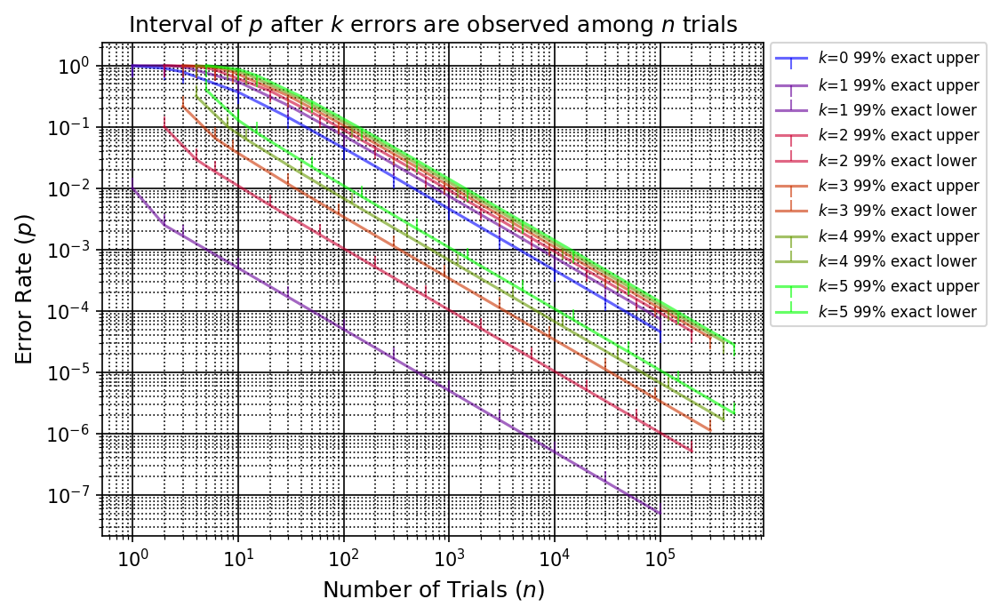
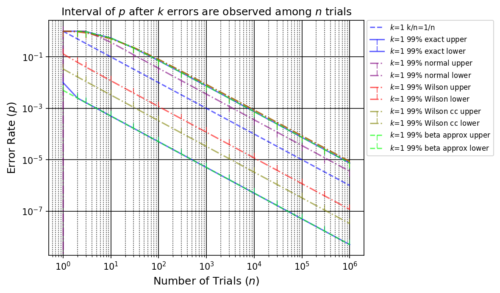
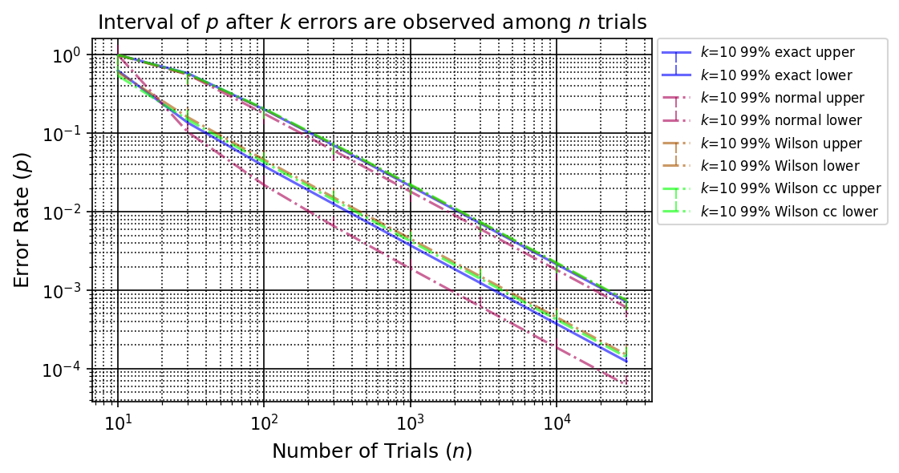
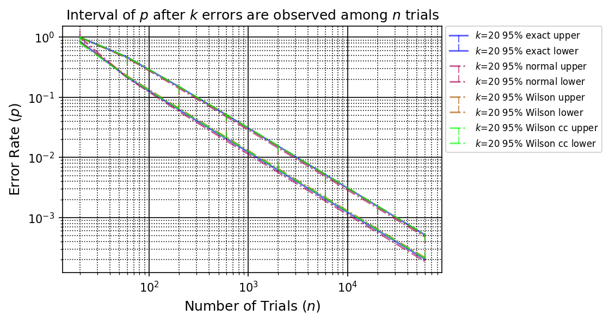

# EBCIC: Exact Binomial Confidence Interval Calculator

These programs are mainly for researchers, developers, and designers who calculate Binomial Confidence Intervals for given parameters:

- n: the number of Bernoulli or Binomial trials.
- k: the number of target events happened.
- confi_perc: Confidence percentage given in percentage between 0 to 100.

[EBCIC](https://kazkobara.github.io/ebcic/) calculates binomial intervals exactly, i.e. by implementing Clopper–Pearson interval [CP34] without simplifying mathematical equations that may deteriorate intervals for certain combinations of the above parameters. EBCIC can also shows graphs for comparing exact intervals with approximated ones.

## How to use

### Jupyter notebook

1. Open [ebcic.ipynb](https://kazkobara.github.io/ebcic/ebcic.ipynb) with either jupyter, jupyter-lab or Visual Studio Code.
2. Run the cells you want to execute.

### Command line (with `ebcic` package)

1. Install [PyPI ebcic package](https://pypi.org/project/ebcic/)

    ~~~console
    pip install ebcic
    ~~~

2. Show help and see the [examples](#Examples) below:

    ~~~console
    python -m ebcic -h
    ~~~

<!--
### Command line (with git `ebcic` repo)

1. Get repo

    ~~~console
    git clone https://github.com/KazKobara/ebcic.git
    cd ebcic
    ~~~

2. Show help or see the [examples](#Examples) below:

    ~~~console
    python -m ebcic -h
    ~~~
-->

### [API Manual](https://github.com/KazKobara/ebcic/tree/master/docs/_build)

1. Download

    ~~~console
    git clone https://github.com/KazKobara/ebcic.git
    ~~~

2. Open the following file with your browser (after replacing `<path to the downloaded ebcic>` appropriately):

    ~~~text
    file://<path to the downloaded ebcic>/docs/_build/index.html
    ~~~

    For WSL Ubuntu-20.04, replace `<username>` and `<path to the downloaded ebcic>` appropriately:

    ~~~text
    file://wsl%24/Ubuntu-20.04/home/<username>/<path to the downloaded ebcic>/docs/_build/index.html
    ~~~

## Examples

### Print exact interval as text

Command line:

~~~console
python -m ebcic -k 1 -n 501255 --confi-perc 99.0
~~~

Jupyter cell to run:

~~~python
"""Print exact interval as text.
Edit the following parameters, k, n, confi_perc, and run this cell.
"""
print_interval(Params(
    k=1,               # Number of errors
    n=501255,          # number of trials
    confi_perc = 99.0  # Confidence percentage (0-100)
))
~~~

Result:

~~~python
===== Exact interval of p with 99.0 [%] confidence =====
Upper : 1.482295806e-05
Lower : 9.99998e-09
Width : 1.481295808e-05
~~~

### Depict graphs (available only with Jupyter)

#### Exact intervals and the line of k/n for k=1

This program can show not only the typical 95% and 99% confidence lines but also any confidence percentage lines.

Jupyter cell to run:

~~~python
interval_graph(GraProps(
    # Set the range of k with k_*
    k_start=1,  # >= 0
    k_end=1,    # > k_start
    k_step=1,   # > 0
    # Edit the list of confidence percentages (0-100):
    confi_perc_list=[90, 95, 99, 99.9, 99.99],
    # Lines to depict
    line_list=[
        'with_exact',
        'with_line_kn',  # Line of k/n
    ],
    ))
~~~

Result:

If figures or links are not shown appropriately, visit [here](https://kazkobara.github.io/ebcic/).

#### Exact intervals for k=0 to 5

Jupyter cell to run:

~~~python
interval_graph(GraProps(
    k_start=0,  # >= 0
    k_end=5,    # > k_start
    line_list=['with_exact']))
~~~

Result:

#### Comparison of exact and approximated intervals for k=0

For comparison with approximated intervals for k=0, `rule_of_la` and `Wilson_cc` are available where:

- `rule_of_la` or `rule of -ln(alpha)` (or `-log_e(alpha)`) denotes the generalized version of `rule of three` [Lou81,HL83,JL97,Way00,ISO/IEC19795-1]. `rule of three` corresponds with `rule of -ln(alpha)` for alpha = 0.05.
- `Wilson_cc` denotes `Wilson score interval with continuity correction` [New98].

As you can see from the following figure, `rule of -ln(alpha)` is a good approximation for n > 20 when k=0.

Jupyter cell to run:

~~~python
interval_graph(GraProps(
    k_start=0,  # >= 0
    k_end=0,    # > k_start
    line_list=[
        'with_exact',
        'with_rule_of_la',  # rule of -ln(alpha)
        'with_normal',      # not available for k=0
        'with_wilson',      # not available for k=0
        'with_wilson_cc',
    ]))
~~~

Result:

#### Comparison of exact and approximated intervals for k=1

For comparison with approximated intervals for k>0, `normal`, `Wilson` and `Wilson_cc` are available where:

- `normal` denotes `normal approximation interval` or `Wald confidence interval` that uses approximation to normal distribution approximation, and are introduced in a lot of textbooks.
- `Wilson` denotes `Wilson score interval` [Wil27].

As you can see from the following figures and warned in a lot of papers, such as [BLC01], and so on, normal approximation intervals are not a good approximation for k < 20. Upper bounds of `Wilson` and `Wilson_cc` are good approximation even for small k, but not necessarily for lower bounds for k < 20.

Jupyter cell to run:

~~~python
interval_graph(GraProps(
    k_start=1,  # >= 0
    k_end=1,    # > k_start
    line_list=[
        'with_exact',
        'with_normal',
        'with_wilson',
        'with_wilson_cc',
    ]))
~~~

Result:

#### Comparison of exact and approximated intervals for k=10

For k=10, `normal` still does not provide a good approximation.

Jupyter cell to run:

~~~python
interval_graph(GraProps(
    k_start=10,   # >= 0
    k_end=10,     # > k_start
    log_n_end=3,  # max(n) = 3*k_end*10**log_n_end
    line_list=[
        'with_exact',
        'with_normal',
        'with_wilson',
        'with_wilson_cc',
    ],
))
~~~

Result:

#### Comparison of exact and approximated intervals for k=20

For k=20, `normal`, `Wilson` and `Wilson_cc` provide good approximation.

Jupyter cell to run:

~~~python
interval_graph(GraProps(
    k_start=10,   # >= 0
    k_end=10,     # > k_start
    log_n_end=3,  # max(n) = 3*k_end*10**log_n_end
    line_list=[
        'with_exact',
        'with_normal',
        'with_wilson',
        'with_wilson_cc',
    ],
    ))
~~~

Result:

## Bibliography

[CP34]:
Clopper, C. and Pearson, E.S. "The use of confidence or fiducial limits illustrated in the case of the binomial," Biometrika. 26 (4): pp.404–413, 1934

[Lou81]: Louis, T.A. "Confidence intervals for a binomial parameter after observing no successes," The American Statistician, 35(3), p.154, 1981

[HL83]: Hanley, J.A. and Lippman-Hand, A. "If nothing goes wrong, is everything all right? Interpreting zero numerators," Journal of the American Medical Association, 249(13), pp.1743-1745, 1983

[JL97]: Jovanovic, B.D. and Levy, P.S. "A look at the rule of three," The American Statistician, 51(2), pp.137-139, 1997

[Way00]: Wayman, J.L. "Technical testing and evaluation of biometric identification devices," Biometrics: Personal identification in networked society, edited by A.K. Jain, et al., Kluwer, pp.345-368, 2000

[ISO/IEC19795-1]: ISO/IEC 19795-1, "Information technology-Biometric performance testing and reporting-Part 1: Principles and framework," 2006

[New98]: Newcombe, R.G. "Two-sided confidence intervals for the single proportion: comparison of seven methods," Statistics in Medicine. 17 (8): pp.857–872, 1998

[Wil27]: Wilson, E.B. "Probable inference, the law of succession, and statistical inference," Journal of the American Statistical Association. 22 (158): pp.209–212, 1927

[BLC01]: Brown, L.D., Cai, T.T. and DasGupta, A. "Interval Estimation for a Binomial Proportion," Statistical Science. 16 (2): pp. 101–133, 2001

## [Changelog](./CHANGELOG.md)

## License etc

[MIT License](./LICENSE)

When you use or publish the confidence interval obtained with the software, please **refer to the software name, version, platform,** , etc, so that readers can verify the correctness and reproducibility of the interval with the input parameters.

Example of the reference is:

~~~text
The confidence interval is obtained by EBCIC X.X.X on Python 3."
~~~

where EBCIC is the name of the software, and X.X.X is the version of it.

The initial software is based on results obtained from a project, JPNP16007, commissioned by the New Energy and Industrial Technology Development Organization (NEDO).

Copyright (c) 2020 National Institute of Advanced Industrial Science and Technology (AIST)
